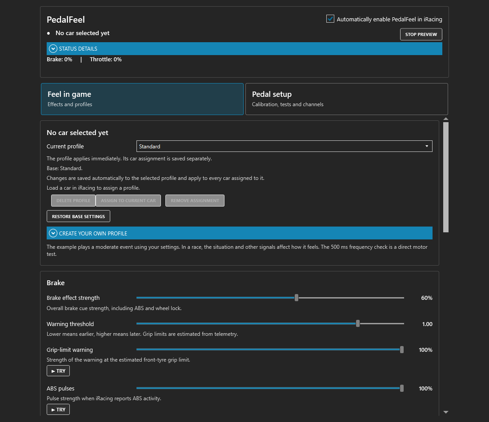
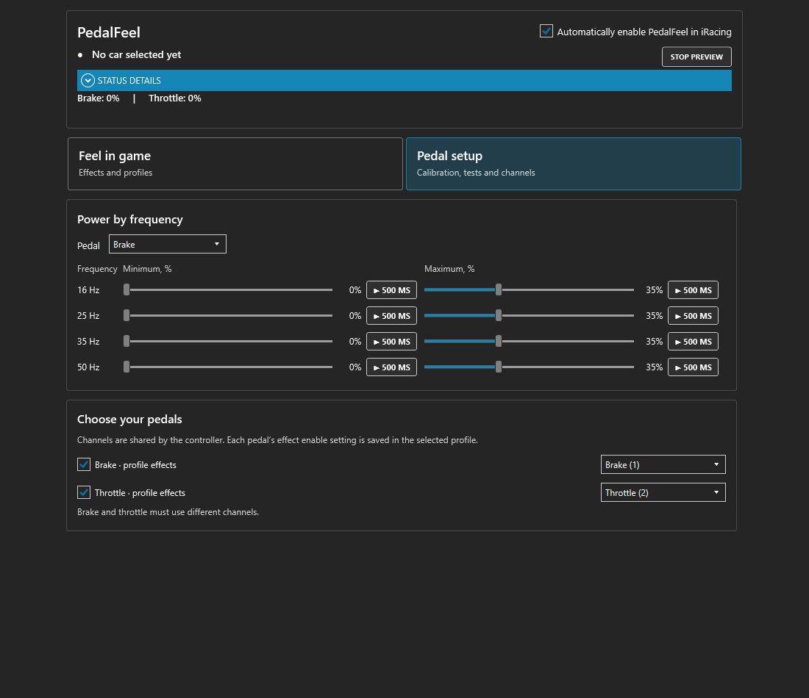

# PedalFeel for SimHub

[Download](https://github.com/Lord-of-the-Bots/PedalFeel-SimHub/releases) · [Share a profile](https://github.com/Lord-of-the-Bots/PedalFeel-SimHub/issues/new?template=profile.yml)

Pedal haptics for iRacing inside your existing SimHub SIMAGIC device. Keep SimHub running, adjust effects, try them without driving, and save named profiles that load for assigned cars.

This unofficial integration is based on [PedalFeel 0.19.0 by UdaraJay](https://github.com/UdaraJay/PedalFeel), which supplies the iRacing telemetry reader and haptic renderers. This project adds SimHub output handover, named profiles and car assignments, separate limiter/downshift controls, effect previews and translated settings. It is independent of, and not endorsed by, SimHub, SIMAGIC or iRacing.

See the interface

Profiles, car assignments and motor calibration in the PedalFeel tab.

[More interface screens](docs/images/README.md)

## Current compatibility

| Requirement | Supported use |
| --- | --- |
| System | 64-bit Windows 10 or 11 |
| Game | iRacing |
| Actuators | SIMAGIC P-HPR through an existing SimHub device |
| SimHub device | **Devices → Simagic Haptic Pedals Reactor (P1000/P2000/P700/P500)** |
| SimHub version | **SimHub versions older than 9.11.21 have not been tested.** |

The pedal families in that entry are SimHub's device name, not a list of physically verified setups. Other motors, P-HPR Neo, P-HPR GT, active force-feedback pedals and other games are not supported by this release. Compatibility with a different generation of SimHub must be confirmed separately.

## Install or update

1. Download **PedalFeel-SimHub-0.5.1.zip** from the release assets and extract it. The **Source code** archives are not the installation package. Close SimHub for installation.
2. Run **Install.cmd**. If prompted, select `SimHubWPF.exe` in your SimHub folder.
3. Start SimHub and open **Devices → Simagic Haptic Pedals Reactor → PedalFeel**. If the device is missing, first add it through **Devices → Add new device → Simagic Haptic Pedals Reactor**. Leave the device enabled.
4. Enable **Automatically enable PedalFeel in iRacing**.
5. In iRacing, disable **Vibrate pedals and wheels** in **Options → Misc**. Stop SimPro's haptic output and close the standalone `PedalFeel.exe` so they do not send competing commands to these motors.
6. Open **Pedal setup**, check the brake/throttle channels and try a low-power frequency test before driving.

Update the complete package together; the plug-in and native engine must match. Existing settings are retained. For manual installation, copy the contents of `plugin` beside `SimHubWPF.exe`, preserving its subfolders.

If installation reports **Access Denied** while writing to the SimHub folder, right-click **Install.cmd** and choose **Run as administrator**.

Under **ShakeIt Motors → Motors Output**, SimHub may already disable the duplicate SIMAGIC output because it is handled in **Devices**. If the old **SIMAGIC Haptic Pedal Reactor** row is still enabled and routed to these motors, turn off that row. Leave unrelated motors, bass shakers and devices as they are.

The original standalone PedalFeel can also run alongside SimHub when SimHub's output to that haptic device is disconnected, as [its author explains](https://www.reddit.com/r/simracing/comments/1uukj7i/comment/oxk3h8x/). This integration handles the handover inside SimHub and keeps the controls in the device's tab.

## When PedalFeel takes control

Automatic mode waits for the **iRacing simulator itself**. Opening the iRacing launcher/UI or selecting iRacing in SimHub is not enough. Outside the simulator, normal SimHub output remains available. An explicit effect preview or motor test temporarily takes control even without the game.

While PedalFeel owns the output, **Effects** and **Hardware settings** explain why their controls are locked. **Return control to SimHub** turns off automatic mode. Closing the simulator returns control automatically; SimHub can take up to four seconds to detect the exit. Pauses and replays produce silence, and stalled telemetry is silenced after 250 ms.

## Profiles

Use **Feel in game** to select a profile and change its effects. The current car and assignment appear above the controls.

1. Open **Create your own profile**, enter a name and choose a **Base**. The new profile belongs to your common library and can be used with any car.
2. Choose **Create profile**. If a car is loaded in iRacing, you can tick **Assign to the current car now**.
3. To assign an existing profile, select it and choose **Assign to current car**. It loads when that car is selected again, including a new session in the same car.
4. Adjust the sliders. Changes save automatically to the selected profile. Every car assigned to that profile uses those changes.

Selecting a profile alone applies it immediately for trying it out; it does not replace the car's saved assignment. Create a **Copy of the selected profile** before making changes that should affect only one car. A copy has independent settings. **Remove assignment** keeps the profile in your library and returns that car to Standard. **Restore base settings** resets the selected profile to its base and affects all cars sharing it.

There are two built-in starting profiles:

- **Standard:** the current user-tuned starting point. Brake strength 60%, threshold 1.00, grip warning 35%, ABS 70%, downshift 100%, upshift 65%, rear grip 30%, engine/idle/limiter 25%, road 70%.
- **Original GT3:** the integration's existing Balanced settings derived from PedalFeel 0.19.0. This retains the previous 20% upshift starting value and full original limiter/downshift coefficients; it is not a separate GT4 setup.

**Create your own profile** copies Standard, Original GT3 or the selected profile. **Assign to current car** saves that association; it loads again when the car is selected. Cars without an assignment use Standard. **Delete profile** removes a custom profile, assigns Standard to all affected cars, and shows a notification. The two built-in profiles cannot be deleted; their settings remain editable.

Brake and throttle strength belong to the profile. The common baseline is fixed at the previous ×1 (internal gain 2.1); there is no overall gain slider. Engine vibration and idle can be adjusted separately on each pedal. The new brake engine controls start at 0% until adjusted. Throttle strength starts at 100%. Hardware channel mapping and frequency calibration remain shared by the device.

On upgrade, retired built-in Subtle, Aggressive and Formula entries are replaced by Standard. User-created profiles and their assignments are retained. The pre-upgrade settings file is copied to a `.before-0.5.0` snapshot; the former common gain is reset to ×1. Frequency calibration is retained.

## Effect previews and motor tests

| Control | What it plays | What affects its power |
| --- | --- | --- |
| **Try** beside an effect in **Feel in game** | Up to two seconds of that effect, using simulated telemetry through the same renderer as driving | Selected profile, pedal strength, enabled pedals and motor frequency limits |
| **500 ms** beside a frequency slider in **Pedal setup** | A direct tone at 16, 25, 35 or 50 Hz | The exact percentage beside that button; profile strength does not apply |

Effect previews cover grip warning, ABS, downshift, rear traction loss, engine and idle on each pedal, limiter, upshift, bumps and kerbs. The unexplained brake-loading and wheel-lock buttons have been removed. Shifts and bumps are single events. Engine and kerb previews change frequency. Examples now use moderate inputs and the same output pipeline as live driving. They illustrate an effect, not a recording of a particular car; simultaneous effects can change its feel while driving.

**Stop preview** ends the example. Another preview or motor test replaces the previous one. Editing settings, changing profiles/game state, disconnecting the device or closing the tab cancels an effect preview. Normal output then resumes: PedalFeel in a running iRacing session, otherwise SimHub. Zero-strength effects remain off during previews.

## Strength and motor calibration

- **Brake / throttle strength:** independent 0–100% controls. Zero silences all effects on that pedal. The common baseline stays at the previous ×1.
- **Individual effect strengths:** 0–100%. Zero disables that effect. Brake strength also scales ABS, locking, downshift, engine and road cues on the brake.
- **Warning threshold:** 0.75–1.05. Lower values warn earlier; this is estimated grip, not motor power.
- **Motor minimum/maximum:** 0–100% at 16, 25, 35 and 50 Hz, separately for brake and throttle.

In **Pedal setup**, select a pedal and use the frequency-row sliders and **500 ms** buttons. Set a barely perceptible minimum and a comfortable maximum at each frequency. Moving a slider saves it without starting the motor. Initial motor limits are 0–35%; adjust them for your actuators, mounting and pedals.

A maximum of 100% is a ceiling, not a request to vibrate constantly at full power. Small game signals can remain small. A high minimum strengthens every nonzero signal, so use effect strength to tune the effect itself. Zero game signal remains silent even with a nonzero minimum.

If redline feedback is too strong, lower **Limiter** for the cutoff pulse or **Engine vibration** for vibration that rises with RPM. These are independent controls.

## Build a useful profile library together

**Please share the settings you actually drive with, including weak or overwhelming effects.** A useful report for one car and one pedal setup helps more than an unexplained claim that a profile works everywhere. The aim is a community library of car/class recommendations with documented hardware and limitations, not supposedly ideal settings for every car.

Use the [profile form](https://github.com/Lord-of-the-Bots/PedalFeel-SimHub/issues/new?template=profile.yml). Include the car/model/class, actuators and controller, mounting, SimHub and plug-in versions, track/scenario, what helps and what still needs work. Attach **the complete Feel in game settings and Pedal setup calibration for every pedal used**. Effect sliders alone cannot describe motor output. See the [sharing guide](docs/PROFILE-SHARING.md).

For faults, use the [bug report form](https://github.com/Lord-of-the-Bots/PedalFeel-SimHub/issues/new?template=bug_report.yml) with **Status details** and steps to reproduce.

## Language, backup and removal

The interface follows SimHub's language: English, Russian, German, French, Italian, Korean and Simplified Chinese.

Back up `PluginsData/PedalFeel` inside your SimHub folder. Each device's JSON file contains its library, assignments and motor settings. `.bak` keeps the previous saved version; unreadable files are retained as `.recovery-*`. Standard ShakeIt profiles are not rewritten. There is no one-click single-profile import/export interface yet; do not replace your device file with another user's entire configuration.

To uninstall, close SimHub and remove `PedalFeel.SimHub.dll` and the `PedalFeel` engine folder. Keep `PluginsData/PedalFeel` to restore your settings later.

## Scope and source

The original estimates are oriented around GT3 and rear-axle traction. ABS and limiter feedback require the corresponding live telemetry flags. Grip, wheel lock and traction estimates can behave differently between cars; this is not a validated model for every drivetrain, surface or racing class. The original application's overlay and CSV recording are not included.

Source: [UdaraJay/PedalFeel](https://github.com/UdaraJay/PedalFeel), version 0.19.0, commit [`06649f3`](https://github.com/UdaraJay/PedalFeel/tree/06649f3cd7c59abaa5f928d82752ae9d8a3956ef). Source and runtime licence notices are included with the release. Building and contributing: [CONTRIBUTING.md](CONTRIBUTING.md).

## Support this integration

You can support development of this SimHub integration with a cryptocurrency donation:

BTC (Bitcoin):
1NbtPNkofnKZRjLpULRjhKuAtbh12DovC9

USDT, TRX (TRC20):
TUgM6hPokF1vPUW8CRp77CgvF3YroabwFP

TON:
UQBLdOWJeVeVg4b0-HkQGNVV8HG6-xWS7moZOUfNBz2-Jf3u

ETH (ERC20):
0x14bba7b8b76ea4743a202bdee2144e4d558ddf93

LTC (Litecoin):
LRRS5YBeqfkYpw2jC2bDAWgpcgm7Wpu6pM
